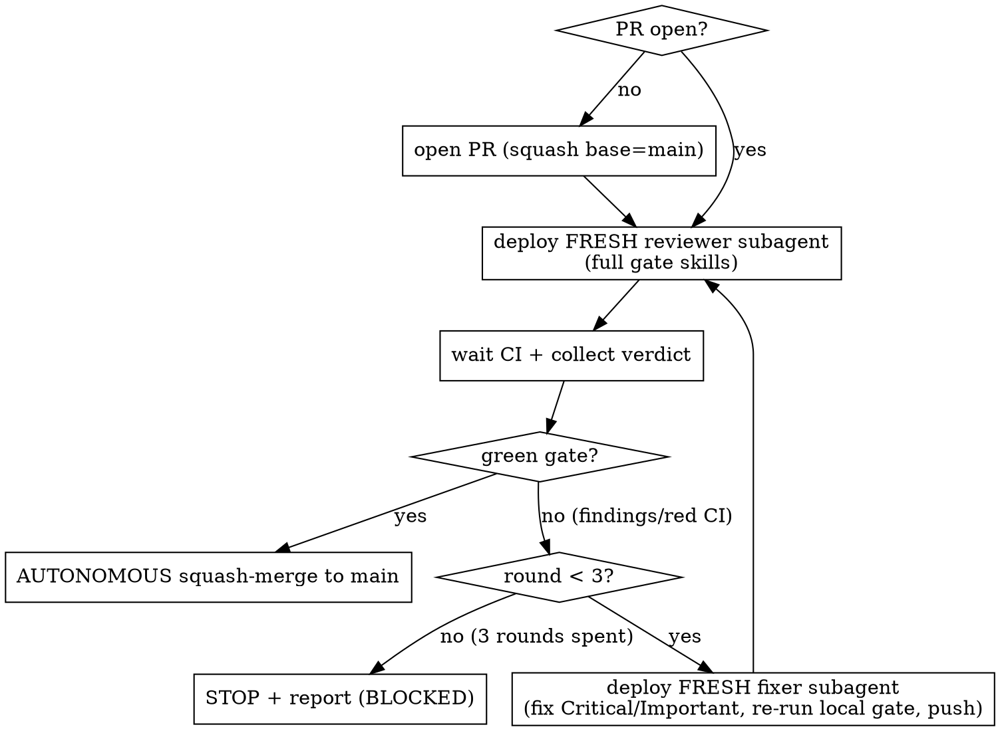

# Sigma Check (review-loop auto-merge)

Twin of `sigma-pr-review`. That skill is the reviewer; this is the **shipper** — it opens the
PR, deploys an **independent** reviewer, loops fix→re-review until the gate is genuinely green,
then **merges autonomously**. Capped at 3 review rounds; if it can't get green, it stops and
reports. Standing authorization: on a clean green gate this merges to main **without pausing**
for sign-off (the operator granted this override for normal feature PRs only — see Hard stops).

## When to use

- A task / full plan / feature branch is finished and the **local gate is green** (tsc + tests + lint), on a branch off `origin/main`.
- Right after `finishing-a-development-branch` chooses "push + PR", or any time work is ready to land on main.

**When NOT to use (these always stop for explicit sign-off — see Hard stops):**
- Releases, tags, version bumps → use `sigmalink-release`.
- Anything force-push / history-rewrite / data-migration / paid / outward-facing beyond the PR merge itself.

## The loop

A "round" = one reviewer deployment + (if it found blockers) one fixer. Max **3 rounds**.

## The green gate (ALL must hold to merge)

1. **CI green** — every required check on the PR passes (`gh pr checks <N>` — not just local tests; the full matrix).
2. **`sigma-pr-review` ≥ 85** — the 6-axis score, verified against PR HEAD.
3. **`/code-review` and `/github-code-review`** — no unresolved **Critical/Important** findings.
4. **`snitch` security clean** — no secrets / high-severity findings on the added lines.
5. **Not behind base** — `behind_by == 0` vs `origin/main` (else request rebase, re-run; counts as a round only if it found code issues).

Minor findings are logged in the report, not blocking. Any one of 1–5 failing = not green → fix loop.

## Independent reviewer (do NOT self-review)

Deploy the reviewer as a **fresh subagent** with its own context — never review your own diff inline. Arm it with the gate skills and have it return a structured verdict:

> Review PR #<N> end-to-end. Use **sigma-pr-review** (6-axis, ≥85 gate, security sweep, verify-against-HEAD), plus **/code-review** and **/github-code-review** on the diff, and **snitch** on the added lines. Read-only — do NOT merge or edit. Return: per-gate pass/fail (the 5 above), every Critical/Important finding with file:line + fix, Minor findings, and a final verdict: GREEN (merge) | FINDINGS (list) | BLOCKED-CI.

On FINDINGS, deploy a **separate** fixer subagent (not the reviewer) to fix only Critical/Important, re-run the local gate (tsc + tests + lint), and push. Then deploy a **new** reviewer (fresh context) for the next round. Reviewer and fixer are always different agents.

## Merge (only when the gate is green)

Delegate the merge to `sigma-pr-review`'s policy:
- **Owner self-PR** (`author == s1gmamale1`): `gh pr merge <N> --admin --squash --delete-branch` (the `--admin` is the can't-approve-own-PR structural case — never to bypass a red gate).
- **Third-party**: `gh pr review --approve` → `gh pr merge <N> --squash --delete-branch`.

After merge: report the verdict + the merge SHA, and run post-ship housekeeping (`wrap-up` / `wrap-up-sigmalink`: prune the branch/worktree, sync docs/memory).

## Hard stops (never auto — stop and report for sign-off)

- The work is a **release / tag / version bump**, or the gate is red and someone says "ship anyway" → push back with the blocker.
- The merge would require **force-push, history rewrite, deleting someone else's branch, or a data migration**, or is otherwise paid/outward-facing.
- The bundled `guard.cjs` denies the action (secret staged, force-push) → stop; never work around it.
- **3 rounds spent without a green gate** → STOP. Report: `verdict=BLOCKED`, every persistent finding with file:line, what each round changed, CI state, and the one decision you need.

## Quick reference

| Step | Action | Tool |
|------|--------|------|
| Open | PR to main | `gh pr create --base main` |
| Review | fresh subagent, full gate | `Agent` + sigma-pr-review · /code-review · /github-code-review · snitch |
| CI | required checks | `gh pr checks <N>` |
| Fix | separate subagent, Critical/Important only | `Agent` + re-run local gate + push |
| Merge | green only, squash | `gh pr merge <N> --squash --delete-branch` (owner: `--admin`) |
| Give up | after round 3 | stop + BLOCKED report |

## Common mistakes

- **Self-reviewing inline** instead of deploying an independent reviewer subagent → weak gate; the reviewer must have fresh context.
- **Running only `/code-review`** → that's one gate of five; the operator's "full gate" is sigma-pr-review ≥85 + /code-review + /github-code-review + snitch + CI + not-behind.
- **Pausing for sign-off on a clean green feature PR** → for normal feature work the merge is authorized; do NOT ask. (The OPPOSITE mistake — auto-merging a release/tag/migration — is a Hard stop.)
- **Letting the loop run forever** → 3 rounds is the cap; round 4 means STOP + report, not "one more try".
- **Reusing the reviewer as the fixer** (or vice-versa) → they must be different agents each round.
- **Merging while behind base** → rebase first.

## Red flags — STOP

- About to merge a **release/tag/version bump/migration** → not this skill; sign-off required.
- About to **force-push** or **`--admin`-merge over a red gate** → forbidden.
- On round 4 → stop, you've spent the budget.
- Merging with an **unresolved Critical/Important** finding or a red check → not green.
